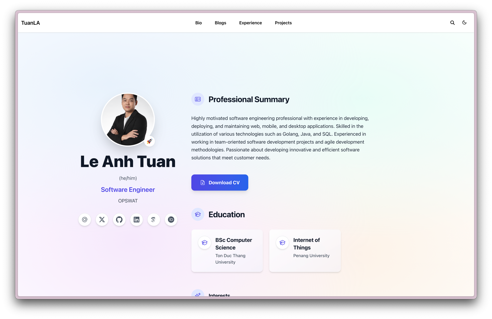

# Personal Website & Blog

[](https://tuanla.vn)

This repository contains the source for my personal website, which showcases my professional experience and houses my blog posts. The site is built with the Hugo Blox framework and published at [tuanla.vn](https://tuanla.vn).

## Features
- **Experience highlights** – Dedicated sections to present projects, roles, and achievements.
- **Blog** – Long-form articles and short updates covering what I am learning and building.
- **Responsive design** – Optimized layouts for mobile, tablet, and desktop visitors.
- **Customizable content** – Modular configuration that makes it easy to add new pages, update metadata, and manage assets.

## Repository structure
- `content/`: Markdown files for pages, blog posts, and resume content.
- `layouts/`: Custom Hugo templates that adjust the look and feel of the site.
- `assets/` & `static/`: Images, styles, and other static resources served directly.
- `config/` & `hugoblox.yaml`: Configuration files that control navigation, theming, and integrations.

## Getting started
1. Install [Hugo Extended](https://gohugo.io/installation/) (required by Hugo Blox).
2. Install Node.js dependencies for asset building:
   ```bash
   npm install
   ```
3. Run the development server:
   ```bash
   npm run dev
   ```
4. Visit `http://localhost:1313` to preview the site locally.

To build the production site, run:
```bash
hugo
```
The generated static files will be placed in the `public/` directory, ready for deployment.

## Deployment
The site is configured for deployment to Netlify via the provided `netlify.toml`. You can also deploy the static files to any static hosting provider or integrate with a CI/CD pipeline of your choice.

## Contributing
This is a personal project, but suggestions are welcome. Feel free to open an issue if you spot a bug or want to propose an enhancement.
