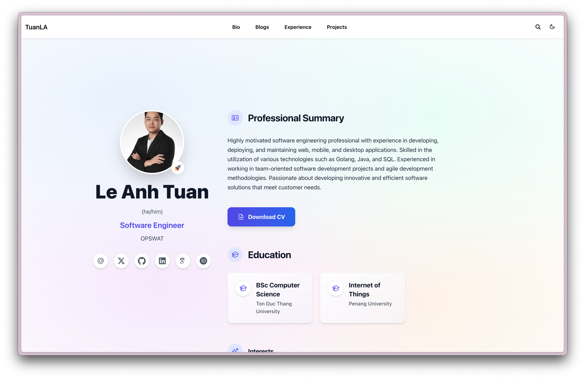

# [The Academic CV That Gets You Hired](https://github.com/HugoBlox/theme-academic-cv)

[](https://tuanla.vn)

<h1 align="center">Build an Academic CV and Resumé That Stands Out</h1>

<p align="center">
  <strong>Your unfair advantage in academia and tech.</strong><br/>
  Showcase your work, boost your citations, and land your dream job at places like <strong>Meta, Google, and Stanford</strong>.
</p>

<p align="center">
  <a href="https://hugoblox.com/templates/academic-cv/start?utm_source=github&utm_medium=readme"><b>🚀 Deploy Your Free CV in 60s</b></a>
  &nbsp;•&nbsp;
  <a href="https://hugoblox.com/templates/?open=academic-cv&loading=true&utm_source=github&utm_medium=readme">Live Demo</a>
  &nbsp;•&nbsp;
  <a href="https://hugoblox.com/pro?utm_source=github&utm_medium=readme"><b>✨ Upgrade to Pro</b></a>
</p>

<p align="center">
  Trusted by 250,000+ researchers, students, and educators worldwide.
</p>

<p align="center">
  <a href="https://discord.gg/z8wNYzb">
    
  </a>
  <a href="https://github.com/HugoBlox/theme-academic-cv">
    
  </a>
</p>

---

## Your Career Starts Here

The Academic CV template is designed for impact. Whether you're an AI researcher, a recent graduate, or a seasoned professor, this is the last resumé you'll ever need.

- **✍️ Showcase Your Expertise:** Easily write content with Markdown, Jupyter, or RStudio. Display your publications, talks, and projects in a stunning, professional layout.
- **📈 Boost Your Citations:** Automatic BibTeX import and SEO-optimized pages mean your work gets discovered more easily, increasing your research impact.
- **💼 Land Your Dream Job:** Create a memorable online presence that impresses recruiters from top tech firms and prestigious universities.
- **🚀 Launch in Minutes:** No coding required. The Hugo Blox Builder lets you customize everything with drag-and-drop sections.

<p align="center">
  <a href="https://hugoblox.com/templates/academic-cv/start?utm_source=github&utm_medium=readme">
    
  </a>
</p>

---

## Level Up with Pro Templates

Ready to take your career to the next level? Our Pro templates offer exclusive designs and features to help you stand out even more.

<!-- <p align="center">
  
</p>-->

| Feature              | Academic CV (Free)       | Academic CV Pro & Resumé Pro     |
| -------------------- | ------------------------ | -------------------------------- |
| **Design**           | Professional & clean     | **Exclusive premium designs**    |
| **Layouts**          | Standard resumé sections | **Advanced layouts & timelines** |
| **Call to Action**   | Simple contact link      | **Prominent CTA buttons**        |
| **First Impression** | Strong                   | **Unforgettable**                |

<br/>
<p align="center">
  <a href="https://hugoblox.com/pro?utm_source=github&utm_medium=readme"><b>💎 Get the Pro Pass</b></a> — Includes all Pro templates for a one-time price.<br/>
  <a href="https://hugoblox.com/templates/academic-cv-pro/start?utm_source=github&utm_medium=readme">✨ Deploy Academic CV Pro</a>
  &nbsp;•&nbsp;
  <a href="https://hugoblox.com/templates/resume-pro/start?utm_source=github&utm_medium=readme">📄 Deploy Resumé Pro</a>
</p>

---

## What Researchers Say

> “Hugo Blox saved me 40+ hours on my lab site. BibTeX integration auto-updates publications — **our citations are up 3×**.”
> — **Dr. Sarah Yang**, AI Researcher

---

## Get Started in Minutes

### Recommended (Fastest)

Deploy your site to GitHub Pages in just 60 seconds with our browser-based starter.

👉 <a href="https://hugoblox.com/templates/academic-cv/start?utm_source=github&utm_medium=readme"><b>Start with the Academic CV Template</b></a>

### Prefer the Command Line?

Use the local quickstart:

```bash
# 1. Install Hugo Extended → https://docs.hugoblox.com/getting-started/install-hugo/
# 2. Clone this starter
git clone https://github.com/HugoBlox/theme-academic-cv my-site
cd my-site

# 3. Run locally
pnpm install && hugo server
```

For more guides, visit our documentation at **https://docs.hugoblox.com/**.

---

## Join the Community

Join thousands of creators in our vibrant community to ask questions, share your work, and help us improve.

- 💬 <a href="https://discord.gg/z8wNYzb">Discord</a>
- 📚 <a href="https://docs.hugoblox.com/?utm_source=github&utm_medium=readme">Docs & Guides</a>
- 🐦 <a href="https://x.com/BuildLore">X / Twitter</a>
- ⭐ <a href="https://github.com/HugoBlox/hugo-blox-builder">Star on GitHub</a>

---

MIT © 2016-Present [George Cushen](https://georgecushen.com)

<!--START_SECTION:news-->
<!--END_SECTION:news-->
