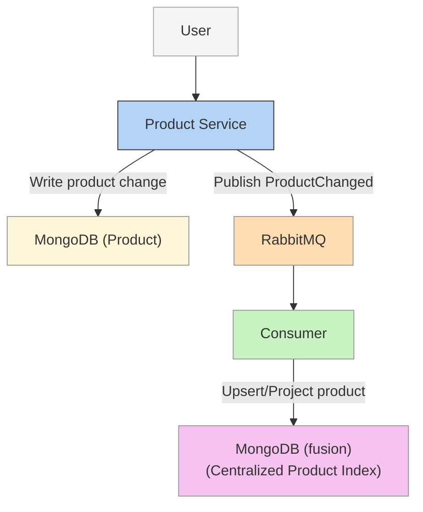
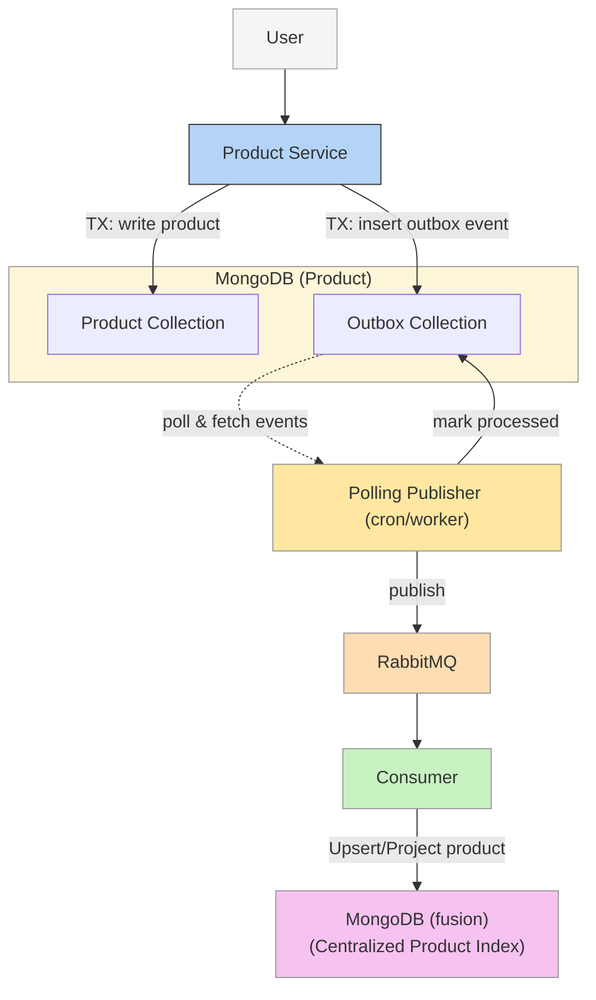
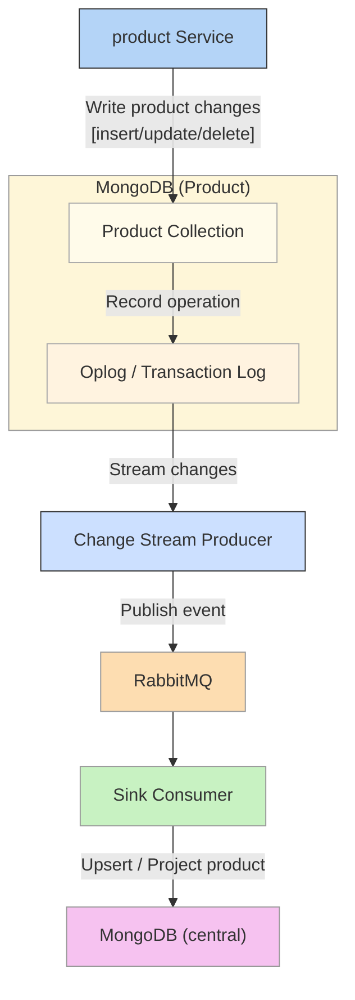
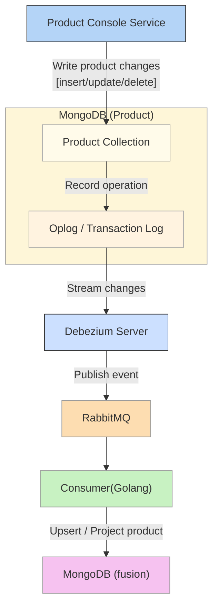

## Introduction

Synchronizing data between two MongoDB clusters can be deceptively complex — especially when we need both consistency and low latency.
Traditional approaches either prioritize speed (but risk losing data) or safety (but introduce delays). 
This article explores a more balanced solution using Change Data Capture (CDC) with Debezium, RabbitMQ, and a Golang consumer.

**The goal:** achieve reliable, real-time synchronization without sacrificing consistency.



## Why This Research Exists?
When we follow a **microservices architecture**, where each service owns its own database and domain logic. 
This independence is great for scalability and deployment, but it creates a major challenge when customers need aggregated views across domains.

A frequent request from our users was a **centralized page** to **search**, **filter**, **and view all products** in one place. 
However, since each microservice stores its product data separately, there’s no single data source to support that unified search efficiently. 
To handle this, we built a new aggregation service — essentially a search index that consolidates product data from multiple services into one dedicated database.

The critical part was keeping this data continuously synchronized with upstream product services in real time.

## Solutions Applied

### 1. Direct Event Push
In this model, the service publishes an event to RabbitMQ immediately after writing to MongoDB.

This approach is simple and works well in happy cases. However, when failures occur (e.g., RabbitMQ is down), data
consistency cannot be guaranteed since the database update and event publishing are not atomic.

**Pros**:
- Low latency — target systems get updates almost instantly.
- Simple to implement — just hook after the database write. 

**Cons**:
- Ricky: data might be updated in MongoDB, but the message broker could fail to receive the event.
- Service must care about infra concerns (data synchronization).

### 2. Outbox Pattern with Polling publisher
Here, both the data and the event are stored within the same MongoDB transaction.
A separate background process (cron/worker) later publishes the event to RabbitMQ.

This approach resolves consistency issues but introduces operational complexity and latency from the polling process.

**Pros**:
- Strong consistency — events are recorded only after data is safely stored. 
- Reliable delivery — supports retry until success (at-least-once guarantee).

**Cons**:
- Introduces delay — events are published on a schedule. 
- Increased operational complexity (polling, cron, cleanup).
- Service must care about infra concerns (data synchronization).

### Trade-offs Summary

| Approach       | Consistency | Latency  | Complexity | Risk | Infra Concern |
|----------------|-------------|----------|------------|------|---------------|
| Direct Push    | Weak        | Low      | Low        | High | Yes           |
| Outbox Pattern | Strong      | Moderate | Medium     | Low  | Yes           |

## Towards a Better Approach
What if we could:
- Send events right after the data is safely committed 
- Without needing to modify application logic 
- Without adding cron jobs or extra tables?

The answer lies in Change Data Capture (CDC) — tailing the database transaction log.
### Transaction log tailing including transaction log
Every MongoDB cluster maintains an oplog (operations log) that records all changes applied to the database.  
By listening to this stream, we can detect inserts, updates, and deletes in real-time — even after the application finishes its writes.

MongoDB provides a built-in change stream API that allows us to listen to the oplog instead of directly tailing
it. It compromise that are optimized, providing more efficient resource utilization and faster execution from MongoDB version 5.1. [Detail here](https://www.mongodb.com/docs/manual/changeStreams)  
However, this approach requires additional implementation effort. This led me to explore _Debezium_, which I'll discuss in the next section.

Let's review what we've achieved with this architecture:
- **Strong consistency**: since changes are captured post-commit.
- **Low latency**: since events are streamed continuously.
- **Non-intrusiveness**: no changes needed in the application code.

### Introducing Debezium
**1. What is Debezium?**

**Debezium** is an open-source **Change Data Capture (CDC)** platform built on top of **Kafka Connect**.  
It monitors databases for real-time changes — including **MongoDB, MySQL, PostgreSQL**, and others — and publishes structured change events (in JSON or Avro) to your chosen message broker such as Kafka, RabbitMQ, or other supported systems.

When used with MongoDB, Debezium reads from the oplog to detect inserts, updates, and deletes, and then streams those events downstream for consumers to process.

**2. why not just use MongoDB’s built-in features?**

**First,** MongoDB already provides a Change Stream API, which allows applications to listen for changes directly without manually tailing the oplog.
However, this requires additional custom implementation, error handling, and message delivery logic — all of which add complexity and operational overhead.

**Second,** MongoDB officially provides Kafka Connector tools for both source and sink connectors ([see official docs](https://www.mongodb.com/docs/kafka-connector/current/)).  
Unfortunately, our infrastructure uses RabbitMQ instead of Kafka. This means the native connectors do not fit into our existing message pipeline.

That’s where Debezium comes in — it offers a reliable and flexible CDC layer that integrates smoothly with RabbitMQ through the Debezium Server.  
By connecting to MongoDB’s oplog, Debezium can publish changes as events directly into RabbitMQ — eliminating the need to write a custom listener or message dispatcher.

**3. The Limitation**

While Debezium simplifies the source side of CDC, it has one notable limitation:
The **Debezium MongoDB Sink Connector** supports only **relational database (RDBMS) sources**.

This means it cannot process change events generated by another Debezium connector — including the **Debezium MongoDB Source Connector**.
In our case, since both the source and sink are MongoDB clusters, the official sink connector cannot be used directly.

So, we still need to **implement our own sink logic** — a custom consumer that reads change events from RabbitMQ and writes them to the target MongoDB (fusion) cluster.
### Architecture Overview
Here’s how the entire system fits together:

1. Product MongoDB Cluster → produces oplog entries. 
2. Debezium Server (Change Stream Producer) → tails the oplog, transforms to events. 
3. RabbitMQ Exchange/Queue → distributes events. 
4. Go App (Sink Consumer) → consumes, filters, transforms, and writes to Target MongoDB Cluster.
5. Fusion MongoDB Cluster -> centralized products.

**Benefits Achieved**

✅ Consistency — events are emitted post-commit.  
✅ Low Latency — oplog tailing means near-real-time sync.   
✅ Resilience — RabbitMQ buffering ensures durability.   
✅ Scalability — multiple consumers can handle different domains or tables.

## Conclusion
In this first part, we explored the real-world challenge of keeping data synchronized across multiple MongoDB clusters — and how Change Data Capture (CDC) provides a modern, reliable way to solve it.
We walked through the evolution from traditional approaches to a CDC-based architecture, and saw how tools like **Debezium** can help bridge consistency, latency, and scalability in distributed systems.

In **Part 2**, we’ll get hands-on with the implementation details, including:
- Setting up Debezium with MongoDB 
- Configuring RabbitMQ for CDC event routing 
- Building a Golang consumer to apply data changes 
- Sharing code samples, deployment notes, and best practices

If this topic interests you — or you’d like to see the setup and code walkthrough in the next part — 💬 **leave a comment below** to let me know! Your feedback gives me the motivation to keep sharing deeper, practical guides.